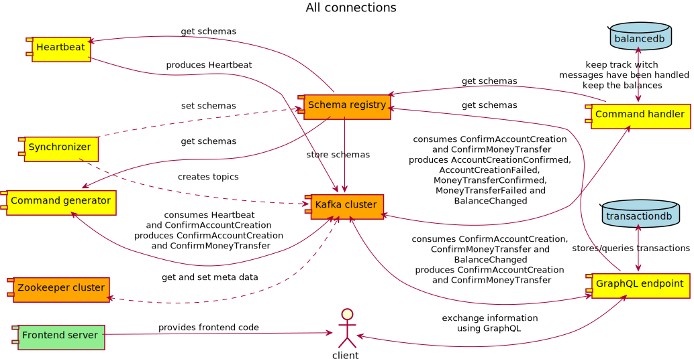

# Open Bank Mark

Contents
* [Intro](#intro)
* [Development](#development)
  * [Building locally](#building-locally)
  * [Building remote](#building-remote)
  * [Building other backend](#other-backend)
* [Modules](#modules)
  * [Topology](#topology)
  * [Synchronizer](#synchronizer)
  * [Heartbeat](#heartbeat)
  * [Command generator](#command-generator)
  * [Command handler](#command-handler)
  * [Graphql endpoint](#graphql-endpoint)
  * [Frontend](#frontend)
  * [Test](#test)
* [Scripts](#scripts)

## <a id="intro">Intro</a>

This workshop is mainly about Kafka and event sourcing. If you don't really know what Kafka is, then it's a good idea to read [an introduction to Kafka](https://hackernoon.com/thorough-introduction-to-apache-kafka-6fbf2989bbc1). For this project we kind of simulate a bank. The article which served as inspiration for this workshop is [real-time alerts](https://www.confluent.io/blog/real-time-financial-alerts-rabobank-apache-kafkas-streams-api/). In general confluent has great documentation and blogs.

As a general rule it's best to have the same kind of messages on a Kafka cluster. Data on the brokers is always stored in a binary format, but for clients it's easier to product and consume in something other than binary, therefore there are a lot of (de)serialiser options. Some of the most common ones are the String(de)seriliser and the KafkaAvro(de)seriliser. For this project I choose to use a String for the keys, and Avro for the values. You can leave the key empty, but when you supply a key, it can be used to divide a topic among partitions. In this project it means that for the 'balance_changed' because we use the iban as key, every message with the same key will end up in the same partition. For the other messages we use the id as key. This will prevent BalanceChanged events to appear in incorrect order in case of hiccups or errors. Another way the keys can be used is to 'overwrite' the message with the same key. You can make a compacted topic, where the last message with some key will always be kept. You can use this with kafka streams api to generate a 'table' view of a topic.

This project and it's modules are build with [Clojure](https://clojure.org/), and uses [Leiningen](https://leiningen.org/) as build tool. Some modules can be used from java, and some of the code generated (Avro classes) are also java. In the 'kotlin-command-handler' project there is an example of using kotlin for the command handler.

The base idea of the project is to serve as an example of event sourcing, where instead of having a 'state' as source of truth we use events. It makes use of some of the best practices by using both events which start with 'Confirm', which need to be handled by another component and lead to either a 'Confirmed' or 'Failed' event. By using id's in the messages, when needed the creator of the 'Confirm' event can eventually know whether the command succeeded. Sometimes there may be additional information in the confirmed events, failed events typically contain the reason why the command failed. Even trough the 'real' source of truth or events, most component keep some kind of state. In this particular project almost all state only exists in memory, and even the Kafka containers are not configured to have use data volumes. Which makes it easy to restart the project, but is not production like. In the postgres branch the command-handler uses a database and is itself stateless.

All the event we use are versioned using [Avro](https://avro.apache.org/), the [Schema Registry](https://docs.confluent.io/current/schema-registry/docs/index.html) is configured with default settings. This makes sure, when using the Avro (de)serialiser, we can update schema's but only with backwards-compatible ones. The serialiser also takes care of converting binary data to/from data in specific records. This is based on the topic, so each type of event currently has it's own topic, since [an enhancement of the Schema Registry](https://www.confluent.io/blog/put-several-event-types-kafka-topic/) it's possible to keep using the Schema Registry for restricting breaking changes, while still being able to put multiple types of events in one topic. This will be part of the Confluent 4.1 release with expected release in April 2018.



## <a id="development">Development</a>

Development is done in clojure, but with a lot of java integration. This is for a large part because there is not a good recent Clojure library. Probably because it's very easy to use the java client from clojure, and because they moved to a 'new' consumer a few years ago. This project is only using the producer and consumer to add or consume data from kafka. But especially when merging topics it might be easier to use the Kafka Streams api. With it you can do things like having a time window, or prefer consuming from one topic over another. This is for example relevant when you have an 'AlertsSettingsUpdated' event which must be combined with a 'MightTriggerAlert' event. Because you want to send alerts, using the latest settings available.

It's certainly possible to have some parts in java, maybe with Spring. But it's easier to put them in a separate repository when needed. Mainly because java has different build tools then clojure. To serve the front-end there is a nginx container, in witch the sources are copied.

### <a id="building-locally">Building locally</a>

There are two out of the box ways to run the project, using the confluent cli, or docker. When developing on linux using docker is preferred, since also local processed can easily use the dockerised kafka, and it's more production-like. For mac and windows this might give more trouble than it's worth to set up properly, and the confluent cli is a nice alternative.

#### Using clojure and confluent cli

This project uses the modules plugin for Leingen. If you have Leingen installed you can build the whole project with `lein modules install`. For the Kafka stuff it's handy to use the [confluent cli](https://docs.confluent.io/current/cli/index.html#cli). With this you can use `confluent destroy` to stop all the processes and `confluent start schema-registry` to start zookeeper, kafka and the schema registry. This will use the 'default' ports, which make it possible to run all the modules without having to set environment variables. Separate modules can for example be started from their 'core' namespace using Cursive.

With both leiningen installed and docker connected to the target docker machine, you can use the build-all.sh script in the root to build all the openweb images.

#### Using docker

Once with the `prepare.sh` script all the fat jars are created with the `restart.sh` script you can use docker to set it up. You will need about 8Gb of ram for docker to not run out of memory.

### <a id="building-remote">Building remote</a>

Make sure sure you are connected to the correct remote docker machine, and that it's fine if all the running containers are stopped and deleted. Also make sure the openweb images from the modules are available on the docker machine (use `docker images` to be sure). With the build-all.sh script in the root all the running containers will be stopped and deleted. And in three phases the needed containers will be started.

Currently the script works with a sleep, to prevent unnecessary errors from other containers not being ready yet. You can ignore the errors about orphan containers apparently this is a side effect of having multiple docker compose files in the same folder. So it might be better to put them all in there own folder so each sub-system can be easily re-created.

### <a id="other-backend">Building other backends</a>

It's possible to add the topology dependency to a jvm project by including (you will need to have run `lein install` in the topology folder or run the `prepare.sh` script to make it work):

```xml    
<dependency>
    <groupId>nl.openweb</groupId>
    <artifactId>topology</artifactId>
    <version>0.1.0-SNAPSHOT</version>
</dependency>
```

This will put the Avro SpecificRecord classes on your classpath, which you need if you want to consume using specific instead of getting an generic Avro class. You can also use these classes to produce. To do this set one as the value of a Kafka ProducerRecord.

If you want to use some of the Clojure functions from java take a look at the last part of [Clojure java interop / calling clojure from java](https://clojure.org/reference/java_interop). Most namespaces also have the gen-class attribute, providing a more direct way of calling the functions.

## <a id="modules">Modules</a>

The modules are describe in order of data flow. The first, topology will be used to generate the data types, the last, frontend will interact with the generated data.

### <a id="topology">Topology</a>

This module generates the java classes needed to use specific avro schemas. This is usually done using a maven plugin, which generates the classes based on .avsc files as is described in the [avro documentation](https://avro.apache.org/docs/1.8.2/gettingstartedjava.html#Compiling+the+schema). [Spring cloud stream schema](https://github.com/spring-cloud/spring-cloud-stream/tree/master/spring-cloud-stream-schema) also has an option to use avro, in that case they need to be in the source directory. The way this integrates with Kafka is however much different from the confluent one, so it most usefull in a spring cloud only environment.

Generating the classes with the maven plugin can be very tedious since there tend to be a lot of repeated elements in schemas. By doing some replacements on the structure in the schemas.edn a lot of these are prevented. For example we always set the namespace of the records to 'nl.openweb.data'. This also allows to have a method, which only needs to names, to get the parsed schema from the generated classes.

The module also provides some convenient functions to consume from and produce to kafka for the use of kafka with clojure. For other languages there are porbably better options.

There are also some functions to deal with specific data types like 'IBAN' and 'UUID'. These function are called in the [ClojureBridge](https://stash.open-web.nl/projects/OP/repos/kotlin-command-handler/browse/src/main/kotlin/nl/openweb/commandhandler/ClojureBridge.kt)

Finally there are functions describing the topics.
The [topology.edn](https://stash.open-web.nl/projects/OP/repos/kafka-workshop/browse/topology/resources/topology.edn) file in the resource folder gives information about the topics, for example:

```clojure
"confirm_money_transfer"     [9 3 :ConfirmMoneyTransfer {} :id]
```

The first part is the actual name of the kafka topic, and in this particular case also serves as the key as part of a map. From the vector, which is the value, we can read that it had `9` partitions `3` replicas, is bound to the `ConfirmMoneyTransfer` avro type (which can be found in the [schemas.edn](https://stash.open-web.nl/projects/OP/repos/kafka-workshop/browse/topology/resources/schemas.edn)), has no additional configuration, and uses the `:id` for the key of the records if the producer from topology is used. This will pick the uuid from the schema, and translated it to a human readable uuid, used as the key for a record.

To be able to use new schemas we need to change the topology.edn and schemas.edn, do a `lein deploy` of the code (maybe with a new version), and run the synchronizer with the new version. Client using the new dependency are now able to produce/consume the new schema from the configured topics.

### <a id="synchronizer">Synchronizer</a>

This module is used to synchronize an actual cluster with the configuration found in the topology module. So when a topic does not exist yet, it creates it, and when there is a topic which is not present in the topology it will be deleted. It will also try to set the schemas for the topics, when there is a schema name provided. Currently it will always assume the schema registry is configured to have a schema for each topic-value. When creating topics it will try to set the replicas to the requested value, but never higher the the amount of brokers available.

There are some limitations in the current implementation:
- When the topic already exist, and also should exist, the configuration of the topic is not checked.
- It's not possible to use any of the new ways to configure the schema registry, this will be easier when the 4.1 release is out.
- Errors are not handled (e.g. no retry), but the responses from setting the schemas can be read.

### <a id="heartbeat">Heartbeat</a>

Since we want to generate events automatically we need something to give the pace. That's the use of this module. It also opens an nrepl (at port 17888) to be able to use `reset!` on the `batch-size` or the `wait-time` to change the pace.

This module produces `Heartbeat` events.

### <a id="command-generator">Command generator</a>

The command generator producers both commands to create a new account (`ConfirmAccountCreation`) and commands to make a transaction(`ConfirmMoneyTransfer`). It also consumes the `AccountCreationConfirmed` events to be able to transfer money to existing other accounts, and have the correct token for those transactions. It consumes `Heartbeat` to determine when and which kind of command to create. Only accounts created with `Atype.AUTO` will be used to generate money transfers.

### <a id="command-handler">Command handler</a>

In order to validate the commands the command handler will do queries on postgres to see whether the message was already handled, and to transfer money and open accounts. When a `ConfirmAccountCreation` is received this will this will almost always generate an `AccountCreationConfirmed` containing the generated token and iban. Only when an existing iban is generated an `AccountCreationFailed` is generated. When a `ConfirmMoneyTransfer` is received there are multiple reason it might fail. The token might be wrong, there me be insufficient funds, or the from and to have the same value. This will trigger a `MoneyTransferFailed` event with the reason. When the transfer succeeds the `MoneyTransferConfirmed` will be returned, containing only the uuid of the command. For each changed account a `BalanceChanged` event is returned.

The command-handler is re-written to use postgres to keep state.

### <a id="graphql-endpoint">Graphql endpoint</a>

This graphql endpoint is by example build using [Stuart Sierra Component Library](https://github.com/stuartsierra/component). This helps keeping dependencies transparent, and also makes it easier for testing/mocking part of the system. With [system-viz](https://github.com/walmartlabs/system-viz) we can also easily create an overview of the system [GraphQL endpoint](/projects/OP/repos/kafka-workshop/browse/graphql-endpoint/system.pdf). To create a new overview use ```lein with-profile viz run```

This endpoint allows querying/streaming `BalanceChanged` events, creating an account/iban and making a transaction, by a streams witch will give feedback whether the action succeeded. It's possible to get a subscription with optional filters. It's also possible to get all transactions from some iban, or the last transactions. The documented graphiql endpoint with can be found [here](http://localhost:8888). The endpoint is created using [lacinia](http://lacinia.readthedocs.io/en/latest/overview.html) together with [lacinia-pedestal](http://lacinia-pedestal.readthedocs.io/en/latest/overview.html).

### <a id="frontend">Front-end</a>

This is a basic nginx container which contains the output from the open-bank project at the moment. Some additional front-end code could be put here. The container is exposed at port 8181.

### <a id="test">Test</a>

An 'script' to test the front-end and takes measurements not only of the latency but also cpu and memory of certain docker containers.

## <a id="scripts">Scripts</a>

There are several scripts to automate things and thus making live easier.
* `clean.sh` stops and removes all used docker container, it does not throw away the images
* `loop.sh` takes a number and will (re)create the whole environment, and run a test x times.
* `prepare.sh` is needed the first time before `restart.sh` can be used. It will get all the dependencies and build jar's. It needs leiningen, maven, sassc to be installed.
* `restart.sh` is used to stop and start the whole setup, it does not start a test. When it's finished the application should be accessible at port 8181. 
* `setup-db.sh` is used to setup the database. It takes the name of the docker container to execute it on as the first argument and the port used as the second.
* `synchronize.sh` is used as part of the restart to set both the kafka topics and schema's in the schema registry.